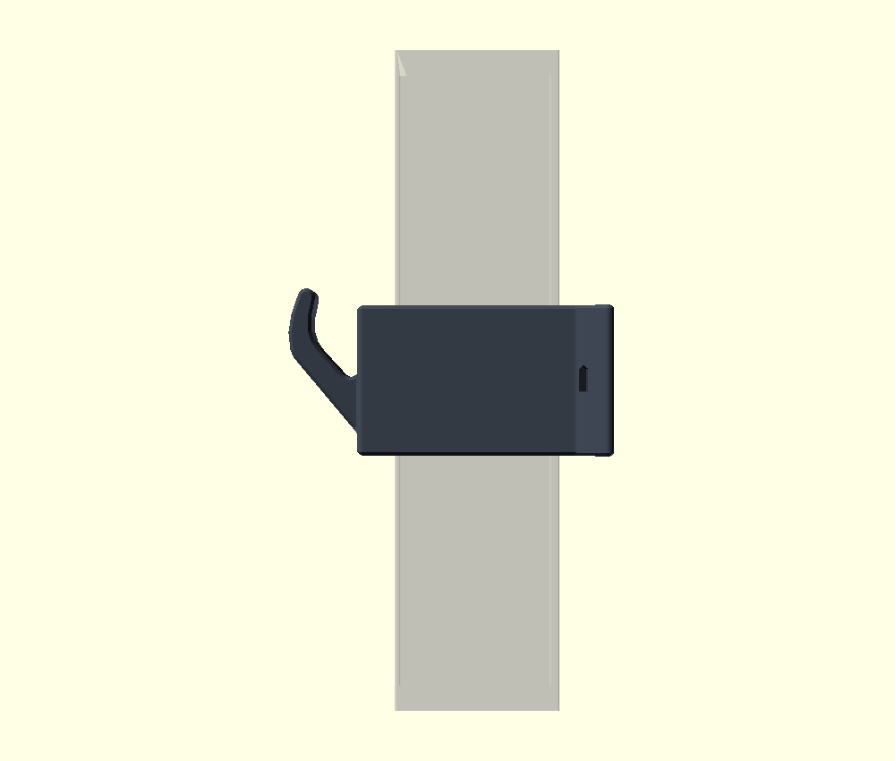

# 3dprint

[](https://github.com/iksaif/3dprint/actions/workflows/ci.yml)

Parametric OpenSCAD models for FDM printing, plus the shared tooling that checks
them. Everything here targets a **Prusa MK4S** (250 × 210 × 220), prints in PETG
with TPU where flex is needed, and prints **without supports** — enforced by
`make check`, which fails the build on any part that would need them. A model
may exempt a named part that deliberately trades support-free printing for a
shape the 45° limit will not give; exactly one part in this repo does.

## Models

| | Model | What it is | Materials | Status |
|---|---|---|---|---|
|  | **[helmet-holder](models/helmet-holder/)** | Clamp for a 40 × 40 mm square post with a swappable extension dock — helmet cradle (two widths), strap hook, lock hook, shelf | PETG + TPU pads | Coupon printing |
|  | **[charging-dock](models/charging-dock/)** | Inclined desk dock for two Anker Zolo A25M2 magnetic pucks, in five visual styles | PETG or PLA + TPU insert | Canaries printed, fits being tuned |
|  | **[post-hook](models/post-hook/)** | Snap-on hook for a 40 × 40 mm post — no screws, three hook sizes, optional cable tie | PETG | Unprinted |

## Layout

```
lib/scad/        shared OpenSCAD: printing constants, holes, 2D/3D shapes
tools/           shared checkers, all pure Python (no venv, no numpy)
mk/model.mk      the shared build rules every model includes
models/<name>/   one model each: src/, tools/, Makefile, README
.claude/skills/  the openscad skill — the render-and-look loop, FDM numbers
.github/         CI: builds every model and runs every check on each push
attic/           superseded files kept for reference; not built, not shipped
```

## Building a model

```bash
cd models/helmet-holder
make            # STLs, 3MFs, print plates, then every check
make check      # just the verification (fast, needs the STLs)
make plates     # just the ready-to-slice 3MF plates
make clean
```

A model's Makefile only declares what is different about it — parts, plates, its
own extra checks — and includes `mk/model.mk` for everything else. A new model is
about fifteen lines of Makefile.

## Verification

The premise: **a part that compiles is not a part that fits, and a part that fits
is not a part that prints.** Those are three separate questions and each gets its
own tool. All of them measure the *exported mesh*, not the source, because the
source is what you already believed.

| Tool | Question it answers |
|---|---|
| `tools/bbox.py` | Does every part fit the bed? |
| `tools/mesh.py` | Is the mesh watertight, consistently wound, one shell? |
| `tools/fitcheck.py` | Do parts that mate overlap? Measured by **volume**, so coincident faces don't cry wolf |
| `tools/support.py` | Would anything print into thin air? Tolerates true bridges, rejects cantilevers and islands |

Plus each model's own `dims` echo, which prints the numbers the geometry actually
implies so its README cannot drift from it.

`support.py` is the one that earns its keep. Every other check passed on a joint
in the helmet holder that could not be printed at all — a dovetail whose lip began
as a 0.2 × 50 mm knife edge in mid-air. See
[models/helmet-holder/INTERFACE.md](models/helmet-holder/INTERFACE.md) for how
that was found and fixed.

## Conventions

Details in [CLAUDE.md](CLAUDE.md). The short version:

- **Every dimension in one file.** `src/params.scad`, nothing hardcoded downstream.
- **Print orientation is a design input, not an afterthought.** A feature prints
  support-free iff at every layer its material rests on material below. Decide the
  orientation first; the geometry follows from it.
- **Removed material is free, added material is not.** A pocket can never start in
  mid-air; only its closing side matters. Undercuts are where parts become
  unprintable.
- **Derive, don't restate.** Screw lengths, counterbore depths and clearances are
  computed from the geometry and echoed, so the BOM cannot drift.

## Getting printable files

STLs and 3MFs are **not** in git — they are build outputs, and a repo that
carries both drifts. Two ways to get them:

- **Build them**: `cd models/<name> && make`. Everything lands in `build/`,
  including ready-to-slice plates in `build/plates/`.
- **Download them**: CI attaches every model's exported parts to its run, and
  tagged releases carry the same files.

Each model's README lists what to print and in which order; the charging dock
also has [PRINTING.md](models/charging-dock/PRINTING.md) for slicer settings,
fit coupons and assembly.

## Contributing

See [CONTRIBUTING.md](CONTRIBUTING.md) — what to install, how to run the
checks, and the five rules a change has to keep. CI runs the same `make` you
do, so green locally means green there.

## Licence

Two licences, split by what the files are:

- **Tooling** — `lib/`, `tools/`, `mk/`, and the repo's own scripts: **MIT**
  ([LICENSE](LICENSE)). Take the checkers and use them anywhere.
- **Models** — everything under `models/`, sources and renders and anything
  exported from them: **CC BY-SA 4.0** ([models/LICENSE.md](models/LICENSE.md)).
  Print them, sell the prints, remix them; credit the source and keep the
  same licence on your changes.
