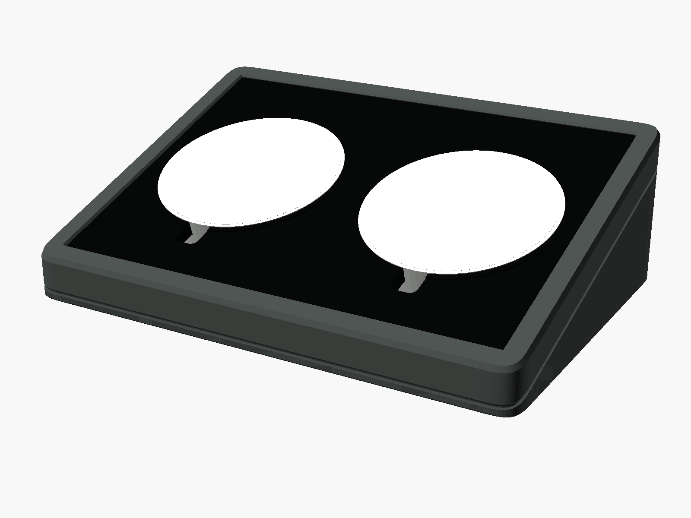
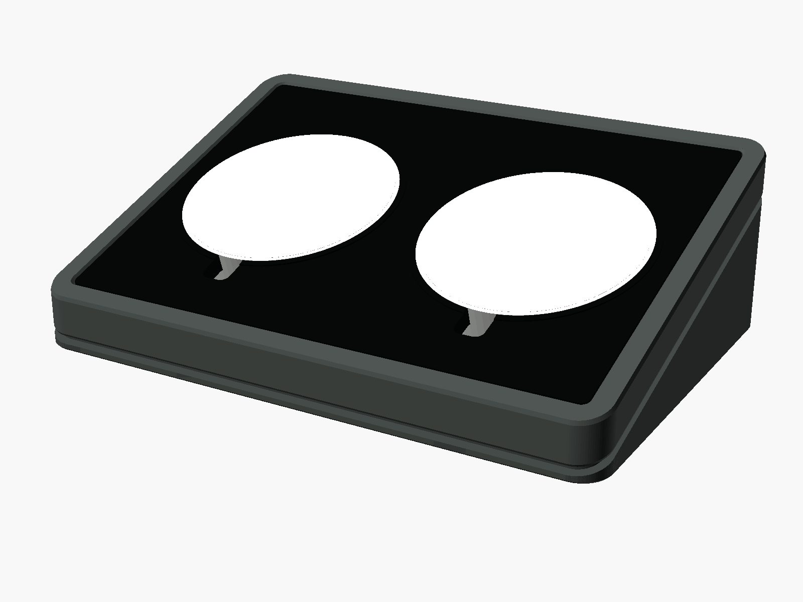
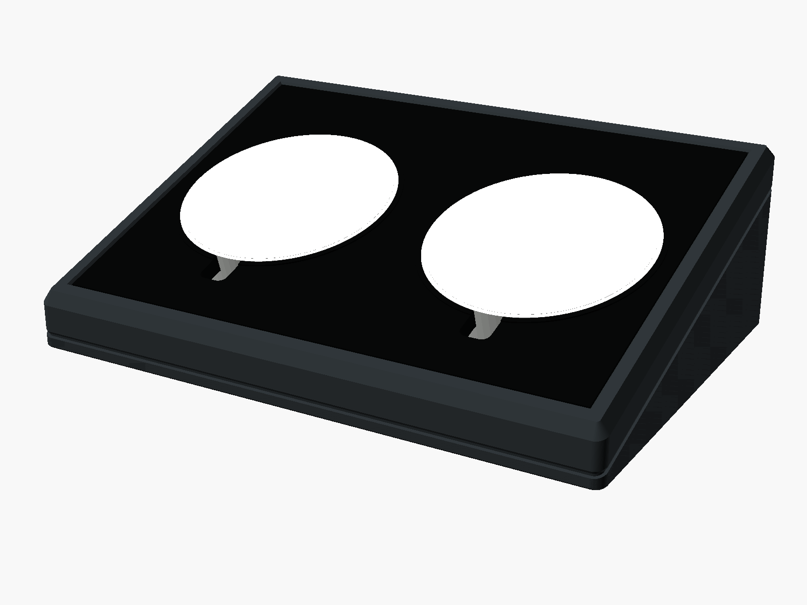
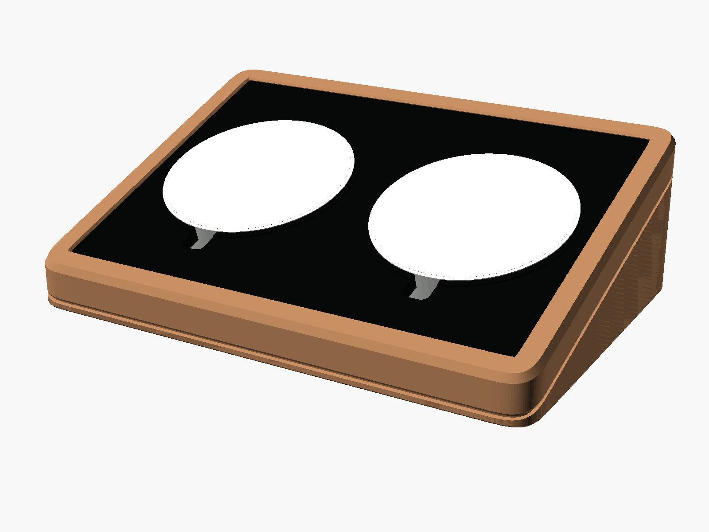

# Dual Wedge Charging Dock

Parametric OpenSCAD model for an inclined desk charging dock sized for two
Anker Zolo A25M2 round magnetic chargers. Three printed parts:

- **base** (PETG) — a wedge whose sloped top face is the puck floor. Carries
  the open-topped cable bay, the plug trenches, the rear slack window,
  eject holes, foot pockets and the debossed rear mark.
- **top plate** (PETG) — a 10.5 mm slab with two through bores for the pucks,
  the recess for the insert, the 6 o'clock cable slots and the locating
  dowel holes. Parted from the base on the inclined plane, with a reveal
  groove running round the body.
- **top insert** (TPU) — flexible mat that fills the recess, frames each puck
  with a raised bezel ring and has a cable notch at 6 o'clock.

Functional core: 6 o'clock rim cable exit, 20 × 20 mm bend envelope in front
of each puck, shared cable bay with rear slack access, 3 mm push-out holes.
No underside centre cable path.

## Dimensions

All numbers are emitted by the model itself — see **`DIMENSIONS.md`**,
regenerated by `make dimensions` (and by `make`). Do not hand-edit it. To see
the figures for a style interactively, set `part = "dimensions"` and read the
console.

Headline values with the defaults: 158 × 110 mm footprint, 18° incline,
14 mm front / 49.7 mm rear, puck bore 60.5 mm (60 + 2 × 0.25 clearance),
recess 5 mm deep, TPU insert 4.35 mm thick with 0.55 mm total clearance,
PETG capture below the TPU 6.15 mm.

**Measure your pucks.** `puck_nominal_diameter` and `puck_radial_clearance`
are separate parameters; the advertised 60 mm is probably rounded. Print
`fit_test` first (see PRINTING.md).

## Styles

Four styles share the functional core and differ only in a lookup table at
the top of the file (`styles`), so adding a fifth is one line:

| style | footprint | top chamfer | reveal | notes |
|---|---|---|---|---|
| `soft_monolith` | r 11 squircle | 1.5 | 0.8 | default |
| `floating_deck` | r 8 round | 1.0 | 2.0 × 2.0 | deep shadow gap: the plate visibly floats |
| `faceted` | r 3 round | 3.0 | 0.8 × 1.0 | crisp planes, 75 mm puck spacing |
| `furniture` | r 14 squircle | 2.0 | 1.0 | broad radii for warm filaments |

| | |
|---|---|
|  |  |
| `soft_monolith` | `floating_deck` |
|  |  |
| `faceted` | `furniture` |

Renders show the dock with the pucks seated; regenerate them with
`make shots` (the `showcase` part). The pucks are reference solids and are
never part of a printable export.

Nested profiles (recess, insert, chamfers) are true parallel offsets of the
outline, so borders are constant-width round every corner in every style.

`style`, `part` and `join_method` all appear as dropdowns in the OpenSCAD
Customizer.

## Parts

| `part` | what |
|---|---|
| `assembly` | everything in place, with non-printing puck and cable reference solids |
| `chassis` | base + top plate assembled (preview only) |
| `base`, `top_plate` | printable PETG parts, print-ready orientation |
| `top_insert_flat` / `mat` | printable TPU insert, flat |
| `top_insert` | TPU insert in place (preview) |
| `dowel_pins` | two 4 × 10 mm locating pins |
| `set_petg` | base + top plate + both dowel pins, laid out on one bed |
| `set_tpu` | the TPU insert, on its own because of the filament change |
| `showcase` | presentation render: the dock with pucks seated, no clearance envelopes |
| `fit_test`, `fit_test_mat` | 40 × 40 mm fit coupons (PETG / TPU) |
| `fit_dummies`, `cable_clearance` | reference solids only |
| `dimensions` | echoes the dimension table |

Fit dummies are never included in the printable exports.

## Join

`join_method`:

- `magnets` (default) — 4 × 6 × 2 mm discs, pockets in both parts.
- `inserts` — 4 × M3 heat-set inserts in the base, screws from the recess
  floor (hidden under the TPU).
- `none` — dowels only.

Two printed dowel pins on the rib between the pucks locate the plate in
every case.

## Build

```
make version     # check OpenSCAD is reachable (default: arch -x86_64 openscad)
make             # every STL + 3MF for every style, plus DIMENSIONS.md
make check       # render everything, run asserts for every style, verify meshes
make sets        # one 3MF per dock, every piece as a separate object
make shots       # showcase render per style into docs/
make fit-test    # the two fit coupons
make soft_monolith_top_plate.stl   # any single file
```

Outputs are `<style>_base`, `<style>_top_plate`, `<style>_top_insert` in
`.stl` and `.3mf`, plus `dowel_pins`, `fit_test`, `fit_test_mat`.
`make check` needs Python 3 with numpy.

Build outputs are gitignored — run `make` to generate them.

### One file per dock

`make sets` writes `<style>_set_petg.3mf`, holding the base, the top plate
and both dowel pins as three separate objects already arranged on one bed
(172 × 235 mm, so it fits a 256 mm bed), and `<style>_set_tpu.3mf` with the
insert. Open the PETG file and slice it as one job; the TPU insert is a
separate job because of the filament change, and all four pieces together
would not fit a single bed anyway.

This relies on OpenSCAD's `lazy-union` (the `LAZY` flag in the Makefile).
Without it, top-level objects are unioned into one mesh on export and the
pieces would arrive fused.

See `PRINTING.md` for orientation, slicer settings, the fit-test procedure
and assembly.
