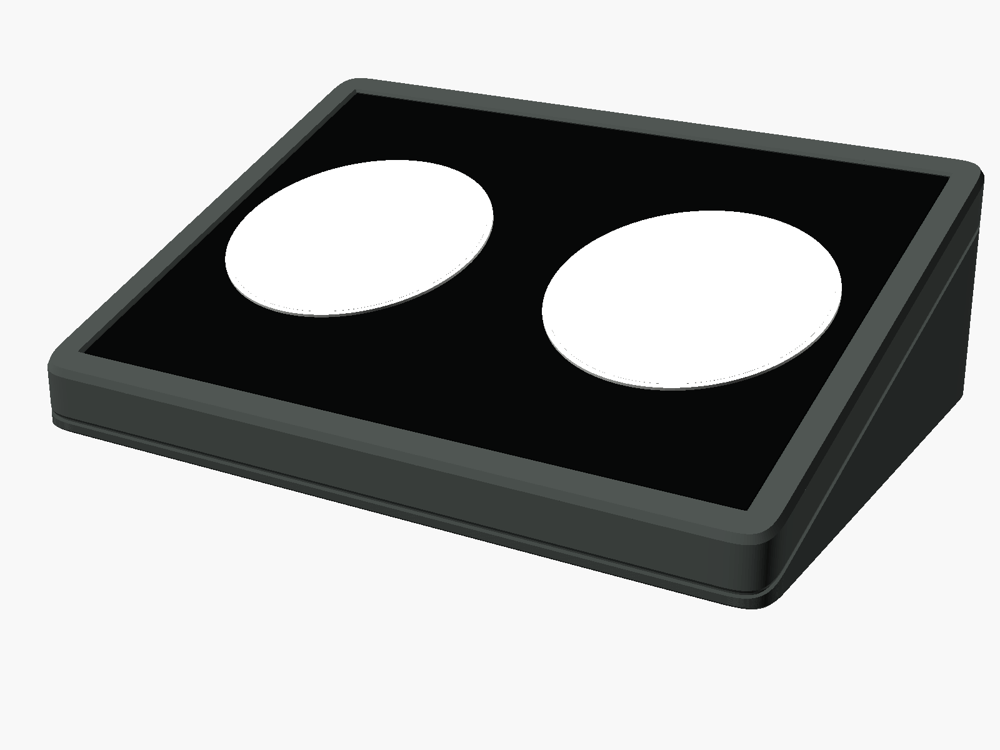
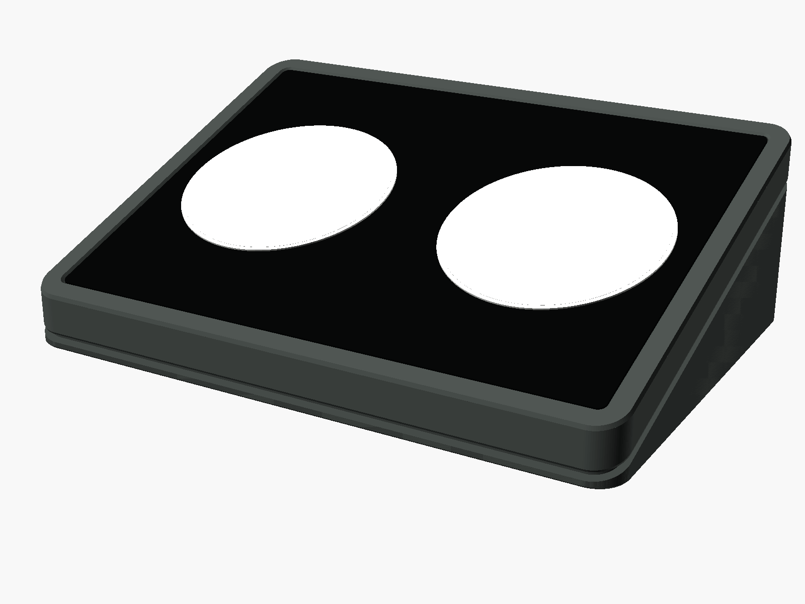
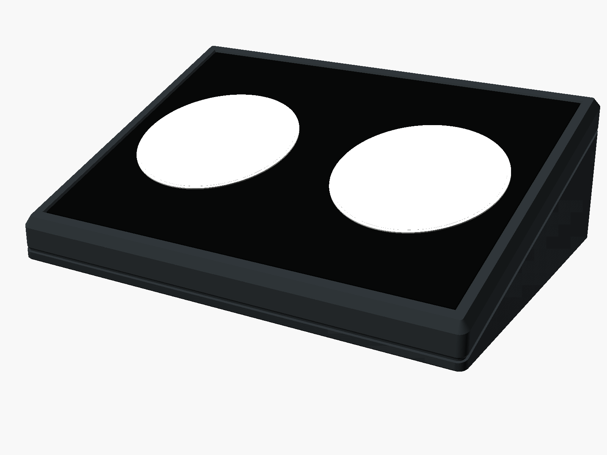
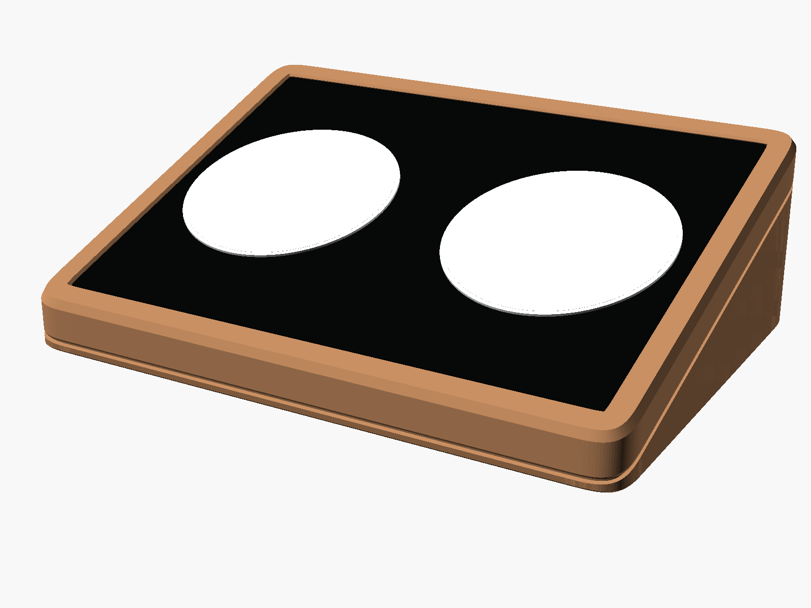

# Dual Wedge Charging Dock



Parametric OpenSCAD model for an inclined desk charging dock sized for two
Anker Zolo A25M2 round magnetic chargers. Three printed parts, all printable
flat and without supports:

- **base** (PETG) — a wedge whose sloped top face is the puck floor. Carries
  the open-topped cable bay, the plug trenches, the rear slack window,
  eject holes, foot pockets and the debossed rear mark.
- **top plate** (PETG) — a 10.5 mm slab with two through bores for the pucks,
  the recess for the insert, the 6 o'clock cable slots and the locating
  dowel holes. Parted from the base on the inclined plane, with a reveal
  groove running round the body.
- **top insert** (TPU) — flexible mat that fills the recess, with a cable
  relief at 6 o'clock: a blind pocket in its underside that swallows the
  cable's boot, so the visible face is unbroken (`mat_cable_pocket`; a through
  notch is the alternative), and holes that taper towards the face
  (`mat_puck_lip`) so a lifted phone cannot pull the puck out — a taper rather
  than a bead, which would peel off its layer.
  Printed face down so its visible face takes the build
  sheet's texture, with five studs underneath that press into holes in the
  recess floor (`mat_dowels`) so it needs no glue. Optional: a grooved CAD
  texture (`mat_texture`) and a raised bezel ring round each puck
  (`mat_bezel`, face-up printing only).

Functional core: 6 o'clock rim cable exit, 20 × 20 mm bend envelope in front
of each puck, shared cable bay with rear slack access, 3 mm push-out holes.
The pucks sit `phone_width + phone_gap` apart, so two phones fit side by side,
and the body width follows.
No underside centre cable path.

## Source layout

Split out of a single 963-line file; the split was verified by exporting every
part before and after and confirming the STLs were byte-identical.

```
src/params.scad   customizer vars, the style table, derived geometry, asserts
src/frame.scad    coordinate frames (top_frame/unframe) and outline helpers
src/base.scad     the wedge: cable bay, trenches, eject holes, feet, rear mark
src/plate.scad    the 10.5 mm slab: puck bores, recess, chamfers, dowels
src/insert.scad   the TPU mat: outline, bezel rings, cable notch
src/parts.scad    dowel pins, reference solids, fit coupons
src/main.scad     assembly, dimension report, plate sets, `part` dispatch
```

`params.scad` is `include`d (it defines variables); everything else is `use`d.

## Dimensions

All numbers are emitted by the model itself, so this README cannot drift from the
geometry. `make check` prints the table for the current style; to see it for
another, `make STYLE=faceted check`, or set `part = "dimensions"` in the
Customizer and read the console.

Headline values with the defaults: 165 × 118 mm footprint, pucks 80 mm apart
(76 mm phones + 4 mm gap), 18° incline, 14 mm front / 52.3 mm rear, puck bore
60.5 mm (60 + 2 × 0.25 clearance), recess 5 mm deep, TPU insert 4.35 mm thick
with 0.55 mm total clearance, PETG capture below the TPU 6.15 mm, cable bay
153 × 20.5 mm (about 108 cm³).

**Measure your phones and pucks.** `phone_width` is the widest phone in its
case. `puck_nominal_diameter` and `puck_radial_clearance`
are separate parameters; the advertised 60 mm is probably rounded. Measure
the cable's rigid boot too (`puck_boot_length`, `puck_boot_width`,
`puck_boot_top_drop`) and the radius of the U-turn the cable makes after it
(`cable_bend_radius`): the TPU notch and the pocket in the base are sized from
them. Print
`fit_test` first (see PRINTING.md).

## Styles

Four styles share the functional core and differ only in a lookup table at
the top of the file (`styles`), so adding a fifth is one line:

| style | footprint | top chamfer | reveal | notes |
|---|---|---|---|---|
| `soft_monolith` | r 11 squircle | 1.5 | 0.8 | default |
| `floating_deck` | r 8 round | 1.0 | 2.0 × 2.0 | deep shadow gap: the plate visibly floats |
| `faceted` | r 3 round | 3.0 | 0.8 × 1.0 | crisp planes |
| `furniture` | r 14 squircle | 2.0 | 1.0 | broad radii for warm filaments |

| `soft_monolith` | `floating_deck` |
|---|---|
|  |  |
| **`faceted`** | **`furniture`** |
|  |  |

Renders show the dock with the pucks seated; regenerate them with
`make shots` (the `showcase` part). The pucks are reference solids and are
never part of a printable export.

Nested profiles (recess, insert, chamfers) are true parallel offsets of the
outline, so borders are constant-width round every corner in every style.

`style`, `part` and `join_method` all appear as dropdowns in the OpenSCAD
Customizer.

## Parts

| `part` | what |
|---|---|
| `assembly` | everything in place, with non-printing puck and cable reference solids |
| `chassis` | base + top plate assembled (preview only) |
| `base`, `top_plate` | printable PETG parts, print-ready orientation |
| `top_insert_flat` / `mat` | printable TPU insert, flat; face down unless `mat_print_face_down = false` |
| `top_insert` | TPU insert in place (preview) |
| `dowel_pins` | two 4 × 10 mm locating pins |
| `set_petg` | base + top plate + both dowel pins, turned 90° and laid out on one bed |
| `set_tpu` | the TPU insert, on its own because of the filament change |
| `showcase` | presentation render: the dock with pucks seated, no clearance envelopes |
| `fit_test`, `fit_test_mat` | 40 × 40 mm fit coupons (rigid / TPU) |
| `fit_test_dowel`, `fit_test_dowel_mat` | press-fit canary: six hole sizes (vented) against six studs |
| `fit_test_cable` | cable-path canary: a slice of the base with the U-turn pocket |
| `fit_test_lip` | puck-lip canary (TPU): a ring of the real mat round one hole |
| `fit_dummies`, `cable_clearance` | reference solids only |
| `dimensions` | echoes the dimension table |

Fit dummies are never included in the printable exports.

## Join

`join_method`:

- `magnets` (default) — 4 × 6 × 2 mm discs, pockets in both parts.
- `inserts` — 4 × M3 heat-set inserts in the base, screws from the recess
  floor (hidden under the TPU).
- `none` — dowels only.

Two printed dowel pins on the rib between the pucks locate the plate in
every case.

## Printing

Every part prints flat, **no supports**, nothing to rotate in the slicer: the
rigid parts top side up, the TPU mat face down. The chassis is parted on the inclined plane carrying the puck floors,
so the puck seats are through-bores and the base's sloped face is the puck
floor. The only downward ceilings are the 6.3 mm magnet pockets and 8.5 mm
foot pockets — both well inside a normal bridging range, and asserted.

| part | material | footprint | notes |
|---|---|---|---|
| `<style>_base` | PETG / PLA | 165 × 118 | flat bottom on bed, sloped face up |
| `<style>_top_plate` | PETG / PLA | 165 × 127 | parting face on bed, top face up |
| `<style>_top_insert` | TPU 95A | 149 × 109 (furniture) | face down, studs up |
| `dowel_pins` | PETG | tiny | print two, standing, 100 % infill |

**Print the fit coupons first.** `make fit-test` gives you `fit_test.stl`
(PETG) and `fit_test_mat.stl` (TPU), ~10 minutes each. Check that a puck
drops into the seat without force or rattle, that the TPU corner lies flat in
the recess, and that the USB-C plug passes the trench — then adjust
`puck_radial_clearance`, `mat_clearance_total` or `rim_cable_channel_*` before
committing filament to a full base.

Quick settings:

- **PETG** — 0.2 mm layers, 4 perimeters, 5 top/bottom, 20 % infill. Ironing
  on the plate's top surface if you have it; the 7 mm border is the most
  visible surface on the object. Leave elephant-foot compensation at or below
  0.1 mm, or the reveal line shows a step.
- **TPU** — 95A, 0.2 mm, 15–25 mm/s, retraction off or minimal. The mat
  prints face down, so a textured or patterned sheet gives the visible face
  its look with no ironing; the studs underneath then point up. A modelled
  groove texture is still available (`mat_texture`: `hex`, `tread`, `rugged`)
  — 0.8 mm grooves cut in, never raised, so the phone still rests on the puck
  faces and the magnetic grip is unchanged.

Full slicer settings, the complete fit-test procedure and assembly (magnets,
cable routing, bumpers) are in **[PRINTING.md](PRINTING.md)**.

## Build

Shared rules come from [`../../mk/model.mk`](../../mk/model.mk); this model's
Makefile only declares what is specific to it.

```
make             # every STL + 3MF + the plate sets, then every check
make check       # just the verification (needs the STLs)
make plates      # the two per-dock 3MF sets
make shots       # showcase render per style into docs/
make fit-test    # the two fit coupons
make all-styles  # build and check all four styles in turn
make STYLE=faceted build/top_plate.stl     # any single file, any style
```

Outputs land in `build/`, which is gitignored — run `make` to generate them.
Everything runs on the system Python: no venv, no numpy.

### One file per dock

`make plates` writes `build/plates/set_petg.3mf`, holding the base, the top
plate and both dowel pins as three separate objects already arranged on one bed
(**249.5 × 173 mm** — the X is what caps `body_depth` at 118 on the MK4S's
250 mm), and `set_tpu.3mf` with the insert. Slice the PETG file as one
job; the TPU insert is separate because of the filament change.

The two PETG parts are laid out side by side, each **turned 90° about Z**.
Stacking them front-to-back is the obvious arrangement and needs ~235 mm of Y —
fine on the 256 mm square bed this model was first written against, 25 mm too
deep for the MK4S's 210 mm. Rotating about Z costs nothing, since both parts
still print flat on the same face. The assert in `src/main.scad` now checks X and
Y separately against a rectangular bed, so this cannot silently regress.

This relies on OpenSCAD's `lazy-union`. Without it, top-level objects are unioned
into one mesh on export and the pieces would arrive fused.

### Verification

`make check` runs the repo's shared checkers against the exported meshes — bed
fit, watertightness, boolean interference between mating parts (the chassis
halves, the mat in its recess, the measured cable path, the mat's studs in
their holes), and
**`support.py`**, which confirms nothing prints into thin air. The model's own
`max_bridge_span` asserts already claimed that in source; this is the first time
it has been measured on the mesh, and all four styles pass.
