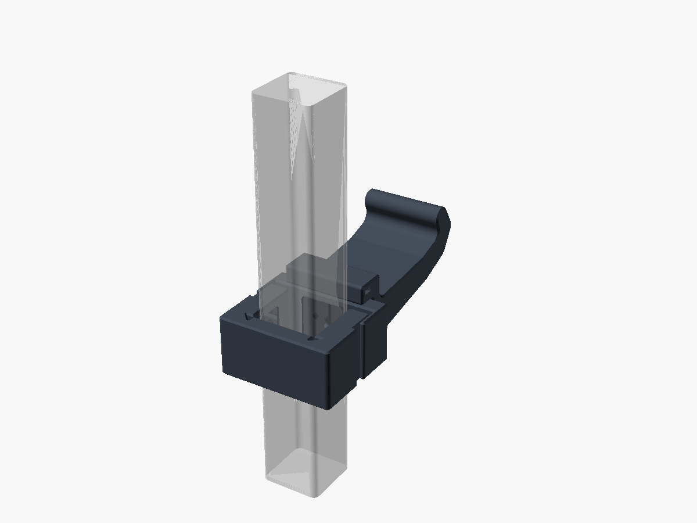
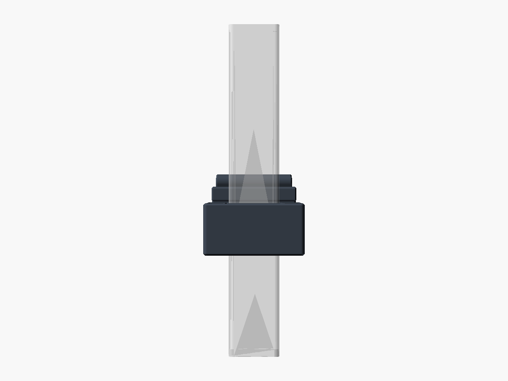
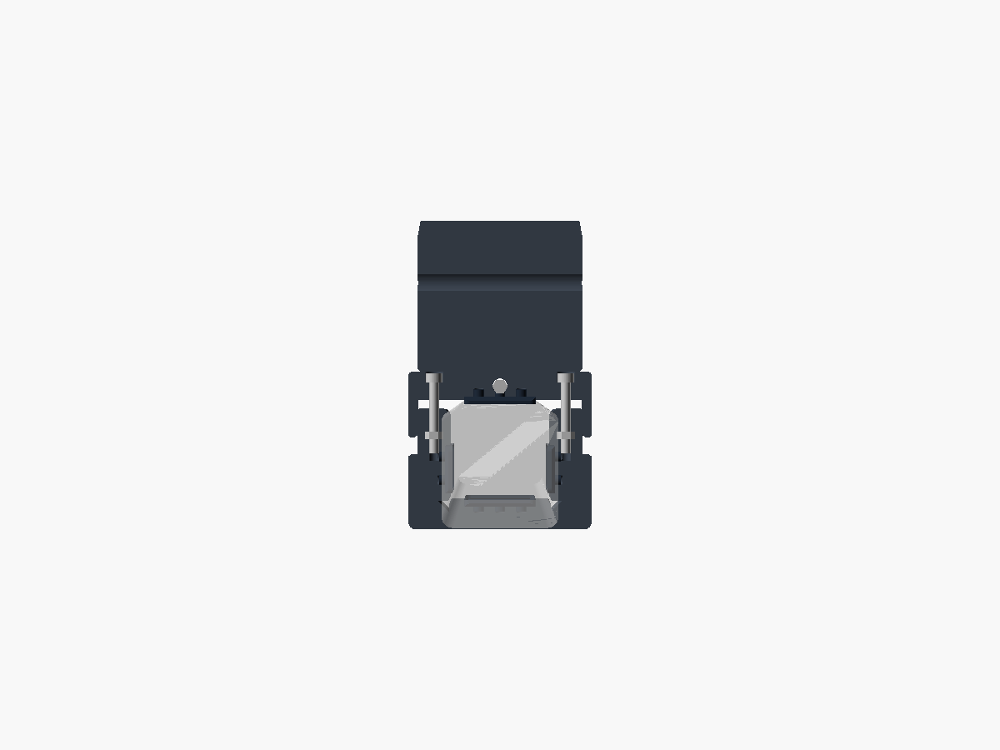
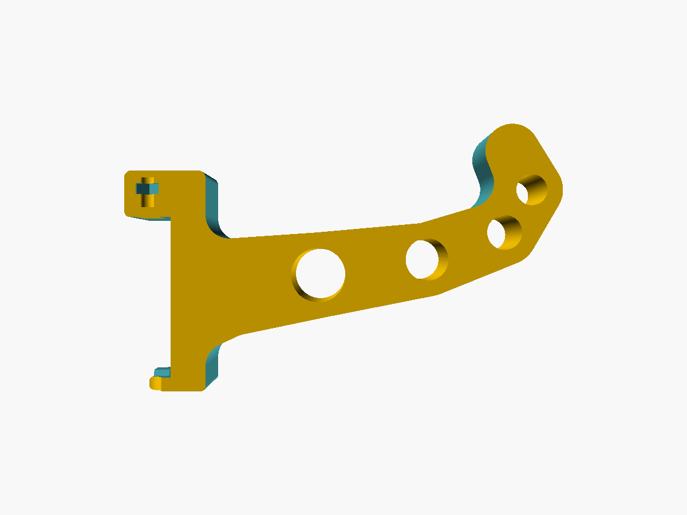
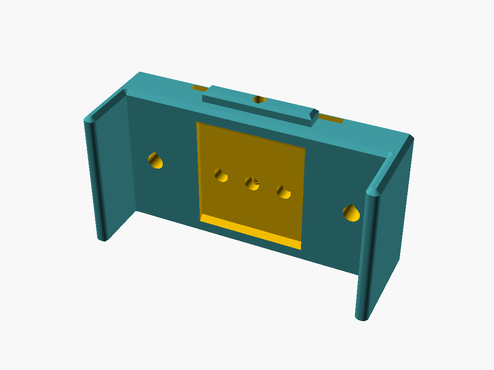
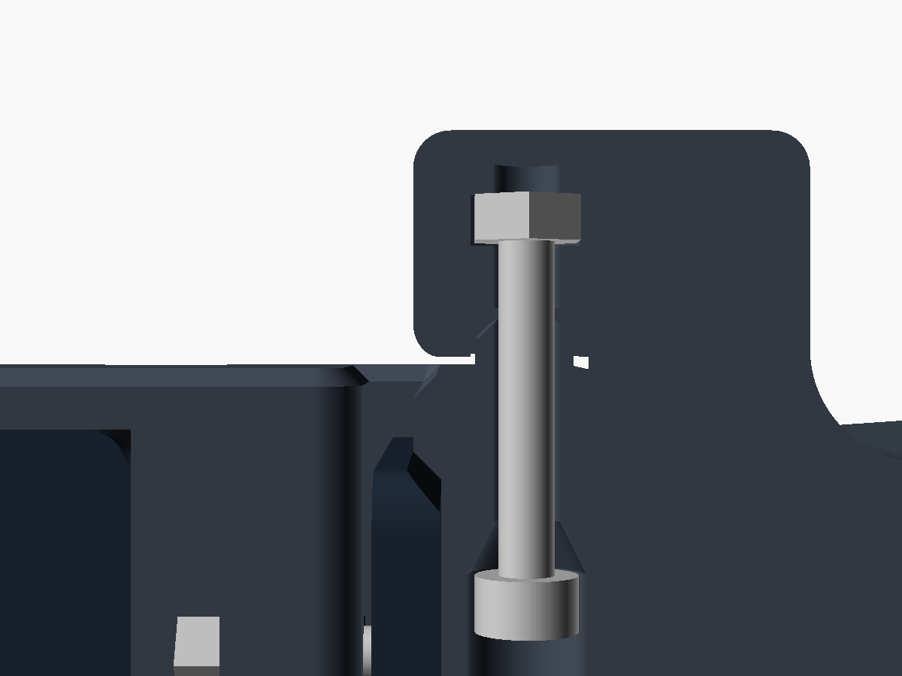
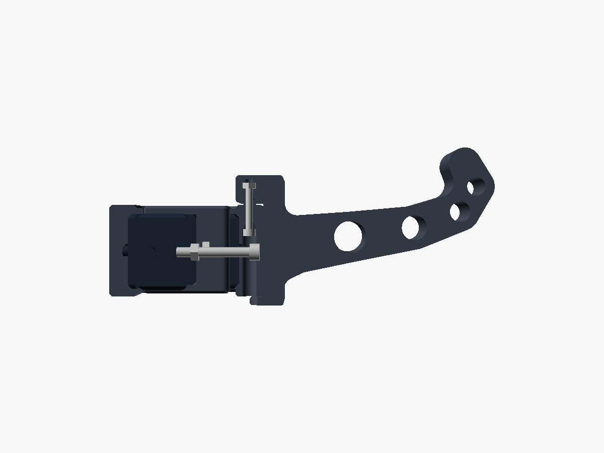
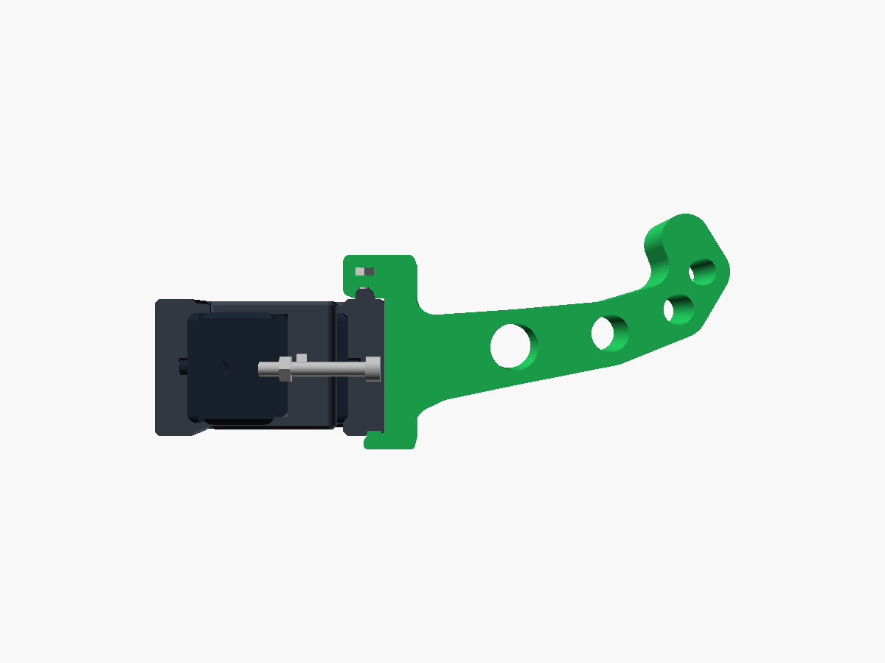

# Post Collar Helmet Holder

A clamp for a **square steel post** (nominally 40 × 40 mm) with a swappable
extension dock. Parametric OpenSCAD; PETG plus TPU pads, printed on a **Prusa
MK4S** with no supports.



```
make            STLs, 3MFs, build plates, then every check
make plates     just the ready-to-slice 3MF plates
make check      just the verification
make renders    the review renders (slow)
```

## Before you print

**Measure your post's left-right width with calipers and set `post_w` in
`src/params.scad`.** The clamp adjusts front-to-back (38–42 mm) but the
left-right axis is a fixed fit that the TPU pads take up. It is the one number
the design cannot guess.

## How it works

* **U-bracket** wraps the post's back and two sides. Each arm end holds a
  captive M4 nut, loaded through a slot in the arm's *inner* face — invisible
  once fitted, and the post itself traps the nut there.
* **Cover** closes the fourth face. It carries the extension ridge on its top
  face, two shallow recesses in its underside for the extension's prisms, and
  the two M4 socket-cap heads, counterbored flush.

Both screws run front-to-back and land on the same face you reach for when you
change an extension. Tightening pulls the cover back and clamps the post.

The cover is a shallow tray whose lips run in rebates cut into the arm ends, so
the outside stays a clean rectangle across the whole adjustment range (lips stay
engaged 10–14 mm). Each part has a 45° relief at its inner corners and bears only
on the post's flats, so the post's corner radius doesn't matter.

Finished size is **78 × 67 × 43 mm** around a 40 mm post (40 mm of collar plus
the 3 mm extension ridge on top). The arms are thicker
than the back on purpose: an arm has to bury a nut and still leave meat outboard
of it for the cover's rebate, which fixes it near 17 mm whatever the post
measures, while the back only ties the two arms together.

| | |
|---|---|
|  |  |

## Extensions

Four ship with the project: **helmet cradle**, **strap hook**, **lock/light
hook**, **shelf**.

**Hang it, then rotate it home.** The groove in the extension's flange drops over
the ridge on the cover's top; swinging the bottom in takes the extension's foot
*under* the cover, and two small prisms on that foot drop into recesses in the
cover's underside. To take it off, press the bottom edge down and pull it toward
you until the prisms clear, then swing out and lift off the ridge.



| | What it does | Optional? |
|---|---|---|
| **Ridge and groove** | Hard stop against the load's moment; its ends locate the extension sideways | Always on |
| **Foot** | Wraps under the cover's bottom edge — stops it lifting off | `ext_hook` |
| **Prisms** | Two 6 × 4 × 1.6 mm wedges on the foot, into recesses in the cover's underside — stop it rotating out | `ext_hook` |
| **M3 × 20 screw** | Up from inside the cover into a nut in the flange | `ext_lock_hole`, or just don't fit it |

### Why hooks and not a snap

There used to be a pair of leaf springs in the cover's face with catch bumps. They
are gone, and the reason is worth keeping: **the ridge at the top is a pivot.**
Once it is in its groove, the extension's only remaining freedom is rotation about
it, so the bottom swings in along an arc. A catch bump designed to cam down a
straight vertical drop never gets a straight vertical drop. On top of that, at
this scale the leaf had shrunk to 1.2 mm over a 15 mm span, which prints badly.

So the retention uses the rotation instead of fighting it, and two separate
features do two separate jobs:

* the **foot** wraps under the cover. Lifting drives it into the cover's
  underside and it runs out of room at **0.8 mm**, while freeing the ridge needs
  **3.45 mm**. It cannot be pulled off, and that is a hard stop between two
  solid faces rather than a detent.
* the **prisms** sit in their recesses and bind as soon as the extension starts
  to rotate back out — measured at 1.5° of nudge.

Getting it off is therefore a deliberate two-part move: press the bottom edge
down about 1.2 mm to lift the prisms clear, pull it toward you, then unhook.

`make check` runs `tools/hookcheck.py` on this, but note what that tool can and
cannot answer. It moves the extension as a rigid body, which proves the foot and
the prisms block what they should. It cannot model the **release**, because that
is a flex — asked to translate down, a rigid extension just drives its own groove
into the ridge and reports a false interference. Whether it comes off by hand is
a question for the coupon.

### Why the joint is on the cover's top, not its face

There used to be a dovetail up the cover's face. It could not be printed. An
undercut in that face runs along X, which is the extension's print Z, so one of
its lips began as a **0.2 × 50 mm knife edge hanging in mid-air**. Tilting it,
steepening it or relieving it only moved the problem — the full analysis is in
[INTERFACE.md](INTERFACE.md).

The fix was to notice that the moment is a **couple**: it needs tension at one
end and compression at the other, not a grip along the whole joint. The top is
the tension end, so that is the only place a hard stop belongs; the bottom is
the compression end and the same moment presses it into the cover's face for
free. So the undercut left the face entirely.

Both parts' print orientations object to the cover's face. Neither objects to
its **top**:

* On the **cover**, the ridge grows straight up out of the finished top face —
  every layer of it lands on solid material.
* On the **extension**, the groove lies in the (Y, Z) profile plane, so it is a
  prism along the extension's own print Z. Free, and extensions stay *one 2D
  profile* to write.

| Ridge on the cover's top | Engaged in the flange's groove |
|---|---|
|  |  |

The same reasoning shapes the prisms. The cover prints upright, so a recess in
its underside has a flat ceiling anchored on both sides — a bridge, which caps
its width at 9.8 mm and is why there are two small prisms rather than one wide
one. The extension prints on its side with X as print Z, so a prism that simply
started partway along X would begin in mid-air; each one therefore ramps up at
45° over 1.6 mm at both ends.

The **foot** is not interface at all — it is part of the extension's own 2D
profile, so it runs the full width and is a prism along the print Z, free by
construction. Only the prisms had to earn their keep against the print.

Every extension carries its foot and prisms whether or not you build the cover
with the recesses, so any extension fits any cover (verified: 0.0000 mm³).

### The lock screw

Nothing protrudes at either end. The screw is **M3 × 20** — a stock length —
and it is the counterbore that adapts, not the screw: the head is swallowed
**29.5 mm up inside the cover** so the tip lands 2.75 mm short of the flange's
top surface. Neither end is visible or catchable, and there is nowhere for water
to sit. It runs up the ridge's own centreline, so ridge, bore and nut share one
datum and cannot be misaligned.

M3 because the screw carries almost nothing — the ridge takes the moment, the
foot takes the lifting, and this only has to stop someone swinging the
extension back out. It also has to sit *between* the two prism recesses, which
is what rules out anything larger.

Only the HEAD's depth depends on `lock_len` — the tip always lands at the same
place, because the counterbore subtracts the same length the tip adds back. So
M3 × 16, × 25 or × 30 work by changing that one number; a shorter screw simply
sits deeper up the bore.

The step from the counterbore down to the shank is a cone at about 27° from
vertical, not the 45° that is exactly the self-supporting limit and always prints
rough. Making it gradual costs nothing: the head just seats a little further up
it, which the derivation accounts for.

| The lock screw, on its axis | The prisms in their recesses |
|---|---|
|  |  |

## Bill of materials

| Qty | Item | Material |
|----:|------|----------|
| 1 | `u_bracket.stl` | PETG |
| 1 | `cover.stl` | PETG |
| 2 | `pad.stl` — back and front | **TPU 95A** |
| 2 | `pad_arm.stl` — the two sides | **TPU 95A** |
| 1+ | any of `ext_helmet` / `ext_strap` / `ext_lock` / `ext_shelf` | PETG |
| 2 | **M4 × 30** socket-cap screw + M4 nut | clamp |
| *1* | *M3 × 20 socket-cap screw + M3 nut* | *optional extension lock* |

3 mm hex key for the clamp, 2.5 mm for the lock. Screw lengths come from the
model, not from guessing — `make check` prints what the geometry needs, and the
lock's counterbore depth is derived from `lock_len`, so if you only have M3 × 30
or × 40 in the drawer, change that one number and the cover follows.

Budget ~145 g of PETG for the clamp and ~110 g for the cradle. Nothing here is
screw-limited: each clamp screw sees about 73 N against an M4's ~3500 N, and the
pads only need ~20 N of normal force not to slip. Tighten it snug, not hard —
the back wall is the part that would complain first.

## Printing

### Profiles (MK4S, 0.4 mm nozzle)

| | PETG parts | TPU pads |
|---|---|---|
| Base profile | **0.20 mm STRUCTURAL** | 0.20 mm QUALITY |
| Perimeters / infill | 4 / 25 % gyroid | 3 / 15 % |
| Supports | none | none |
| Brim | 5 mm on the cover only | none |
| Speed | profile default | cap at **20 mm/s** |
| Nozzle / bed | 240 / 85 °C | 230 / 50 °C |

STRUCTURAL prints perimeters slower and bonds layers noticeably better than
SPEED, which matters at the extension's root. The cover is the only part that
wants a brim — it stands 43 mm tall on a 29 mm footprint.

The prism recesses in the cover's underside are the only bridges on that part:
**9.8 mm** of flat ceiling each, and they sit on the first layer so they are easy
to inspect. That span is also why the prisms are small. If you ever want more
grip, add a third prism rather than widening one — a wider recess is a longer
bridge.

### Plates

`make plates` writes **one 3MF per material**, each holding every part in that
material. Each part is a separate object, so the slicer can move, delete and
arrange them individually.

| File | Contents | Beds |
|---|---|---|
| `build/plates/coupon.3mf` | **Print this first** — real cover + armless extension | 1 |
| `build/plates/petg.3mf` | U-bracket, cover, and all four extensions | 1 |
| `build/plates/tpu.3mf` | 2 × `pad`, 2 × `pad_arm` | 1 |

The **coupon** is the whole interface with none of the mass: it checks the ridge
fit, the hook engagement and the lock screw for a quarter of a real extension's
plastic. Three numbers here are calculated rather than measured — `ridge_clear`
at 0.45 mm, `prism_clear` at 0.3 mm and the prisms' 1.2 mm engagement — and this is what
settles all three. Pay attention to whether the extension swings home without
forcing and cannot then be lifted off.

At 40 mm the whole set fits **one** MK4S bed: 238 × 176 mm of a 250 × 210 bed,
~28,900 mm² of footprint against 52,500. It needed two beds at 100 mm. The
layout in `petg.3mf` is a real arrangement, but pressing `A` in PrusaSlicer will
still tidy it for whatever bed you actually have configured — and that is the
right way round, because PrusaSlicer stores no plate metadata and
[infers bed membership purely from object coordinates](https://help.prusa3d.com/article/multiple-build-plates-on-prusaslicer_823894)
against an internal grid.

Never mix PETG and TPU in one job.

### Why no supports

Print each STL in the orientation it is exported in.

| Part | Orientation | Why it works |
|---|---|---|
| U-bracket | Flat, post axis = Z | Screws load the arms in tension, along the layers. Bores are horizontal teardrops; nut slots bridge 10 mm. |
| Cover | Standing on its bottom edge | Lips and rebates are constant in Z, and the extension ridge grows straight up out of the finished top face. The two prism recesses are the only bridges: 9.8 mm each, on the first layer. |
| Extensions | On their side, width = Z | Essentially a pure extrusion, so bending runs along the layers, and the foot and lightening holes are free by construction. The prisms are the one addition, ramping at 45° against print Z so they never begin in mid-air. |
| Pads | Flat, studs up | Trivial. |

## Assembly

1. Push a TPU pad into each of the four pockets — `pad` on the U's back and on
   the cover, `pad_arm` on the sides. The studs are an interference fit; no glue.
2. Slide an M4 nut into the slot on the **inner** face of each arm end.
3. Slide the U onto the post from the front.
4. Offer the cover up so its lips slide over the arm ends, start both M4 screws
   into the nuts, tighten alternately — snug, not hard.
5. Hang the extension on the ridge — tilt its bottom out a few degrees, drop the
   flange's groove over the ridge — then swing the bottom in until it sits flat.
   The two tabs enter their pockets as it closes. It should need no force.
6. *Optional:* slide the M3 nut into the slot in the extension's side, then run
   the M3 × 20 screw up from underneath the cover into it. It disappears
   entirely — you will need a 2.5 mm hex key on a shaft, not a stubby.

**To move it:** back both screws off a few turns, slide, retighten.
**To swap an extension:** press the bottom edge down about 1.2 mm to lift the
prisms out of their recesses, pull it toward you, then lift it off the ridge. It
cannot be pulled straight up — the foot grounds on the cover's underside after
0.8 mm and the ridge needs 3.45 mm to clear.

## Extension interface


Write a `*_profile()` in the (Y, Z) plane — Y outward from the post, Z up — and
pass it to `extension()`. Slot, roof, flange, foot, lock bore, nut pocket, prisms,
fillets and chamfers are all added for you — the profile is the only thing you
write, and nothing you can put in it will need support.

```
Ridge (on the cover's TOP)     30 long x 5 wide x 3 tall, centred, 6 mm back
                               from the cover's outer face. 1.0 mm chamfer on
                               top as a lead-in. Grows out of the finished top
                               face, so every layer lands on solid material.
Groove (in the flange)         the same, +0.25 mm all round, open downwards.
                               CLOSED at both ends in X — that is what locates
                               the extension sideways. Its front wall is the
                               hard stop against the load's moment: 3.25 mm
                               thick, and it sees 0.82 MPa at 3 kg.
Flange                         reaches 12 mm back over the cover, clearing its
                               top by 0.15 mm at the front (the bearing face)
                               and 0.8 mm behind the groove, so the extension
                               can tilt 3.4 deg to get its hooks in without the
                               back edge grounding. 13 mm deep to stack the
                               ridge groove and the lock nut above it.
Lock                           o3.5 blind bore up the ridge's own centreline —
                               ridge, bore and nut share one datum, so they
                               cannot be misaligned. Into an M3 nut above the
                               groove, its slot opening on the +X side face.
                               Omit it with ext_lock_hole = false.
Foot    extension              part of the PROFILE, not interface: full width,
                               6 mm back under the cover, 3.5 mm thick, its top
                               0.4 mm clear of the cover's underside. Bored
                               o7.3 on the centreline to pass the lock screw's
                               head — a teardrop pointing at +X, because that is
                               the print's Z on this part.
Prisms  extension              two at x = +/-9, 6 wide x 4 deep x 1.6 tall on
                               the foot's upper face, each ramping to zero over
                               1.6 mm at both ends in X (= 45 deg against
                               print Z). They engage 1.2 mm.
        cover                  two recesses in the UNDERSIDE, 9.8 x 4.6 x 1.5
Envelope                       70 wide x 9 thick x 53 tall, plus the foot below

Every SUBTRACTION here is a pocket — no undercuts anywhere. That is the trick:
removed material can never start in mid-air, so nothing you cut will need
support. The prisms are the only addition, and they pay for themselves with a
45 deg ramp at each end.
```

Ideas for more: track pump cradle, bidon holder, glove pegs, drip rail, a second
cradle scaled to 70 % for a kid's helmet, shoe hooks, cable loop.

## Verification

`make check` measures the exported meshes rather than trusting the source:

* **`bbox.py`** — every part fits the MK4S bed
* **`mesh.py`** — watertight, consistently wound, normals out
* **`fitcheck.py`** — boolean interference between mating parts, by volume
* **`hookcheck.py`** — whether the retention actually retains. The fit check
  cannot answer this: with clearance on every face, tabs correctly seated and
  tabs missing their pockets entirely both intersect the cover in nothing, so
  both pass. This one *moves* the extension — raising it until it fouls, tilting
  it until it does not — and asserts the two answers come out the right way
  round.
* **`strength.py`** — bending stress section by section
* **`support.py`** — material that would print into thin air. Correctness and
  printability are different questions, and every other check only asks the
  first. This is the one that caught the dovetail that used to be in the joint.
* **echoes** — screw lengths, cover-lip engagement, the hook's lift margin
  against the ridge's, the pocket bridge span, and the tab ramp angle

Run at the default `--reach 8` everything passes. Tightened to `--reach 1` only
two things remain, both deliberate bridges: the captive-nut slots span 10 mm
across the arm ends, and the ridge groove's closed ends span 2.2 mm. The cover
and the pads are clean even at `--reach 1`.

At **3 kg** (3× spec) the cradle's worst section reads **0.61 MPa, 1.2 % of PETG
yield** — an 82× margin — and it falls at y = 40 mm, right at a lightening hole,
which is exactly where it should. The other three extensions land between 0.55
and 0.91 MPa. The arms are 70 mm wide because the print orientation demands it,
and that is far more than the load needs.

Those numbers are new, and the old ones were wrong. `strength.py` reads the
profile off the part's chamfered outer face, which is inset by `chamfer`, so any
station within 1.2 mm of the back face was measuring the flange and the foot as
two thin slivers a long way apart — a tiny second moment and a spectacular
stress that was pure artefact. That artefact WAS the reported peak for the whole
life of the tool: 3.19 MPa while the sliver was thin, 0.69 MPa once the foot grew
and filled it, and never the structural root either time. The walk now starts
past the chamfer. What
actually limits the load is whether the TPU pads slip on the post, not part
strength: if it ever sags, tighten the screws or fit softer pads.

`strength.py` reads its dimensions out of `params.scad` rather than keeping its
own copy — it used to hardcode them, and quietly went on reporting a 50 mm cover
and an M6 screw after the design was rescaled to 40 mm.

## Files

```
src/params.scad      every dimension, in one place
src/clamp.scad       u_bracket, cover, pads
src/extensions.scad  the four extensions + the extension() wrapper
src/plates.scad      the build plates
src/main.scad        part selector, assembly, cutaway, derived-dimension echoes
tools/               model-specific checks: strength.py, fitcheck.scad, probe.scad
build/               STLs, 3MFs, plates/, renders/
```

Shared with the rest of the repo, one level up:

```
../../lib/scad/      teardrops, hex pockets, rrect/stroke/smooth2d,
                     chamfered_extrude, and the printer constants
../../tools/         bbox.py, mesh.py, fitcheck.py, support.py
../../mk/model.mk    the build rules — this model's Makefile is ~25 lines
```

Render one part with e.g.
`openscad -o x.png -D 'part="cover"' -D 'cutaway="z"' -D cut_at=25 src/main.scad`
