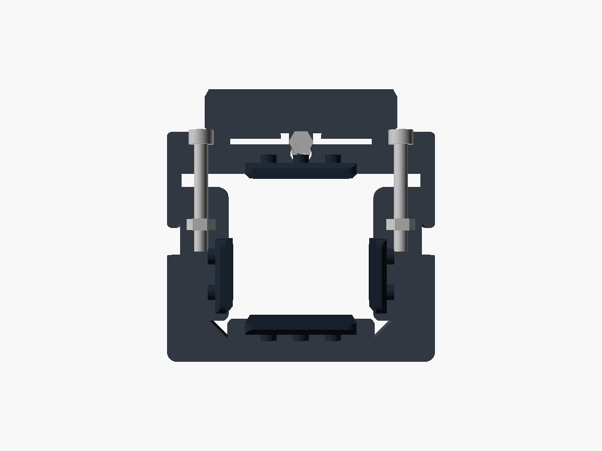

# Post Collar Helmet Holder

A clamp for a **square steel post** (nominally 40 × 40 mm) with a swappable
extension dock. Parametric OpenSCAD; PETG plus TPU pads, printed on a **Prusa
MK4S** with no supports.


```
make            STLs, 3MFs, build plates, then every check
make plates     just the ready-to-slice 3MF plates
make check      just the verification
make renders    the review renders (slow)
```

## Before you print

**Measure your post's left-right width with calipers and set `post_w` in
`src/params.scad`.** The clamp adjusts front-to-back (38–42 mm) but the
left-right axis is a fixed fit that the TPU pads take up. It is the one number
the design cannot guess.

## How it works

* **U-bracket** wraps the post's back and two sides. Each arm end holds a
  captive M4 nut, loaded through a slot in the arm's *inner* face — invisible
  once fitted, and the post itself traps the nut there.
* **Cover** closes the fourth face. It carries the extension ridge on its top
  face, the snap's two leaf springs, and the two M4 socket-cap heads,
  counterbored flush.

Both screws run front-to-back and land on the same face you reach for when you
change an extension. Tightening pulls the cover back and clamps the post.

The cover is a shallow tray whose lips run in rebates cut into the arm ends, so
the outside stays a clean rectangle across the whole adjustment range (lips stay
engaged 10–14 mm). Each part has a 45° relief at its inner corners and bears only
on the post's flats, so the post's corner radius doesn't matter.

Finished size is **78 × 67 × 43 mm** around a 40 mm post (40 mm of collar plus
the 3 mm extension ridge on top). The arms are thicker
than the back on purpose: an arm has to bury a nut and still leave meat outboard
of it for the cover's rebate, which fixes it near 17 mm whatever the post
measures, while the back only ties the two arms together.

| | |
|---|---|
|  |  |

## Extensions

Four ship with the project: **helmet cradle**, **strap hook**, **lock/light
hook**, **shelf**. Drop one on from above — the ridge on the cover's top enters
the groove in the extension's flange, and the snap clicks.


| | What it does | Optional? |
|---|---|---|
| **Ridge and groove** | Hard stop against the load's moment; its ends locate the extension sideways | Always on |
| **Snap** | Two leaf springs in the cover click into a groove in the extension | `ext_snap` |
| **M3 × 35 screw** | Up from inside the cover into a nut in the flange | `ext_lock_hole`, or just don't fit it |

To remove a snapped extension, pull it firmly upward — about **1.9 kg**. The
catch faces are 45°, so it cams apart under a deliberate tug and is nowhere near
letting go under a helmet.

The extensions are the one thing that did *not* shrink with the post: a helmet
is the same size whichever post you hang it on. They kept their width and most
of their reach, so the cradle is now large relative to its clamp — which is
fine, because what limits the load is the pads' grip on the post, not the
plastic (18× margin on bending at 3 kg).

### Why the joint is on the cover's top, not its face

There used to be a dovetail up the cover's face. It could not be printed. An
undercut in that face runs along X, which is the extension's print Z, so one of
its lips began as a **0.2 × 50 mm knife edge hanging in mid-air**. Tilting it,
steepening it or relieving it only moved the problem — the full analysis is in
[INTERFACE.md](INTERFACE.md).

The fix was to notice that the moment is a **couple**: it needs tension at one
end and compression at the other, not a grip along the whole joint. The top is
the tension end, so that is the only place a hard stop belongs; the bottom is
the compression end and the same moment presses it into the cover's face for
free. So the undercut left the face entirely.

Both parts' print orientations object to the cover's face. Neither objects to
its **top**:

* On the **cover**, the ridge grows straight up out of the finished top face —
  every layer of it lands on solid material.
* On the **extension**, the groove lies in the (Y, Z) profile plane, so it is a
  prism along the extension's own print Z. Free, and extensions stay *one 2D
  profile* to write.

| Ridge on the cover's top | Engaged in the flange's groove |
|---|---|
|  |  |

The same reasoning put the snap's **spring on the cover** rather than the
extension: a leaf running the cover's full height is identical on every layer,
while a finger on the extension would begin in mid-air. The extension's half is
a plain groove — removed material, which can never be an unsupported island.

Every extension gets both grooves whether or not you build the cover with the
spring, so any extension fits any cover (verified both ways: 0.0000 mm³).

### The lock screw

Nothing protrudes at either end. The screw is **M3 × 35** — a stock length —
and it is the counterbore that adapts, not the screw: the head is swallowed
**15.2 mm up inside the cover** so the tip lands 2.9 mm short of the flange's
top surface. Neither end is visible or catchable, and there is nowhere for water
to sit. It runs up the ridge's own centreline, so ridge, bore and nut share one
datum and cannot be misaligned.

M3 because the screw carries almost nothing — the ridge takes the moment, the
snap takes the lifting, and this only has to resist a deliberate pull. It also
has to thread *between* the two snap leaves on a 78 mm cover, which is what
rules out anything larger.

`lock_len` drives the counterbore depth, so M3 × 30 or × 40 work by changing
that one number.

| The lock screw, on its axis | Leaf and bump, sliced — every layer looks like this |
|---|---|
|  |  |

## Bill of materials

| Qty | Item | Material |
|----:|------|----------|
| 1 | `u_bracket.stl` | PETG |
| 1 | `cover.stl` | PETG |
| 2 | `pad.stl` — back and front | **TPU 95A** |
| 2 | `pad_arm.stl` — the two sides | **TPU 95A** |
| 1+ | any of `ext_helmet` / `ext_strap` / `ext_lock` / `ext_shelf` | PETG |
| 2 | **M4 × 30** socket-cap screw + M4 nut | clamp |
| *1* | *M3 × 35 socket-cap screw + M3 nut* | *optional extension lock* |

3 mm hex key for the clamp, 2.5 mm for the lock. Screw lengths come from the
model, not from guessing — `make check` prints what the geometry needs, and the
lock's counterbore depth is derived from `lock_len`, so if you only have M3 × 30
or × 40 in the drawer, change that one number and the cover follows.

Budget ~145 g of PETG for the clamp and ~110 g for the cradle. Nothing here is
screw-limited: each clamp screw sees about 73 N against an M4's ~3500 N, and the
pads only need ~20 N of normal force not to slip. Tighten it snug, not hard —
the back wall is the part that would complain first.

## Printing

### Profiles (MK4S, 0.4 mm nozzle)

| | PETG parts | TPU pads |
|---|---|---|
| Base profile | **0.20 mm STRUCTURAL** | 0.20 mm QUALITY |
| Perimeters / infill | 4 / 25 % gyroid | 3 / 15 % |
| Supports | none | none |
| Brim | 5 mm on the cover only | none |
| Speed | profile default | cap at **20 mm/s** |
| Nozzle / bed | 240 / 85 °C | 230 / 50 °C |

STRUCTURAL prints perimeters slower and bonds layers noticeably better than
SPEED, which matters at the extension's root. The cover is the only part that
wants a brim — it stands 43 mm tall on a 29 mm footprint.

The snap's leaf is **1.2 mm** thick, which at a 0.45 mm extrusion width is two
perimeters plus a little gap fill rather than a whole number of lines. That is
deliberate: the gap lands on the leaf's neutral axis, where bending stress is
zero. Do not "tidy" it to 0.9 mm — the snap force goes as the cube of thickness
and would drop from 19 N to 8 N.

### Plates

`make plates` writes **one 3MF per material**, each holding every part in that
material. Each part is a separate object, so the slicer can move, delete and
arrange them individually.

| File | Contents | Beds |
|---|---|---|
| `build/plates/coupon.3mf` | **Print this first** — real cover + armless extension | 1 |
| `build/plates/petg.3mf` | U-bracket, cover, and all four extensions | 1 |
| `build/plates/tpu.3mf` | 2 × `pad`, 2 × `pad_arm` | 1 |

The **coupon** is the whole interface with none of the mass: it checks the ridge
fit, the snap force and the lock screw for a quarter of a real extension's
plastic. Two numbers in this design are calculated rather than measured —
`ridge_clear` at 0.25 mm and the snap's 19 N — and this is what settles both.

At 40 mm the whole set fits **one** MK4S bed: 238 × 176 mm of a 250 × 210 bed,
~28,900 mm² of footprint against 52,500. It needed two beds at 100 mm. The
layout in `petg.3mf` is a real arrangement, but pressing `A` in PrusaSlicer will
still tidy it for whatever bed you actually have configured — and that is the
right way round, because PrusaSlicer stores no plate metadata and
[infers bed membership purely from object coordinates](https://help.prusa3d.com/article/multiple-build-plates-on-prusaslicer_823894)
against an internal grid.

Never mix PETG and TPU in one job.

### Why no supports

Print each STL in the orientation it is exported in.

| Part | Orientation | Why it works |
|---|---|---|
| U-bracket | Flat, post axis = Z | Screws load the arms in tension, along the layers. Bores are horizontal teardrops; nut slots bridge 10 mm. |
| Cover | Standing on its bottom edge | Lips, rebates and the whole leaf spring are constant in Z. The snap bump's two faces are 45°, and the extension ridge grows straight up out of the finished top face. |
| Extensions | On their side, width = Z | A pure extrusion, so bending runs along the layers and the snap groove spans the full width. Only the lock bore and the flange's nut pocket break the section, and both are small. |
| Pads | Flat, studs up | Trivial. |

## Assembly

1. Push a TPU pad into each of the four pockets — `pad` on the U's back and on
   the cover, `pad_arm` on the sides. The studs are an interference fit; no glue.
2. Slide an M4 nut into the slot on the **inner** face of each arm end.
3. Slide the U onto the post from the front.
4. Offer the cover up so its lips slide over the arm ends, start both M4 screws
   into the nuts, tighten alternately — snug, not hard.
5. Drop the extension on from above — the ridge enters the groove in its
   flange — and push down until the snap clicks.
6. *Optional:* slide the M3 nut into the slot in the extension's side, then run
   the M3 × 35 screw up from underneath the cover into it. It disappears
   entirely — you will need a 2.5 mm hex key on a shaft, not a stubby.

**To move it:** back both screws off a few turns, slide, retighten.
**To swap an extension:** pull it firmly upward — the snap cams apart at ~1.9 kg.

## Extension interface


Write a `*_profile()` in the (Y, Z) plane — Y outward from the post, Z up — and
pass it to `extension()`. Slot, roof, flange, lock bore, nut pocket, snap groove,
fillets and chamfers are all added for you — the profile is the only thing you
write, and nothing you can put in it will need support.

```
Ridge (on the cover's TOP)     30 long x 5 wide x 3 tall, centred, 6 mm back
                               from the cover's outer face. 1.0 mm chamfer on
                               top as a lead-in. Grows out of the finished top
                               face, so every layer lands on solid material.
Groove (in the flange)         the same, +0.25 mm all round, open downwards.
                               CLOSED at both ends in X — that is what locates
                               the extension sideways. Its front wall is the
                               hard stop against the load's moment: 3.25 mm
                               thick, and it sees 0.82 MPa at 3 kg.
Flange                         reaches 12 mm back over the cover, clearing its
                               top by 0.15 mm, 13 mm deep to stack the ridge
                               groove and the lock nut above it
Lock                           o3.5 blind bore up the ridge's own centreline —
                               ridge, bore and nut share one datum, so they
                               cannot be misaligned. Into an M3 nut above the
                               groove, its slot opening on the +X side face.
                               Omit it with ext_lock_hole = false.
Snap    cover                  1.2 mm leaf, x = 6..21 (anchored outboard),
                               2.2 mm flex slot behind, face set back 0.3 mm.
                               Bump at x = 6.5..11, 1.0 mm proud, z = 5..10,
                               both faces 45 deg
        extension              groove across the full width, 1.25 mm deep,
                               z = 4.75 .. 13.25
Envelope                       56 wide x 9 thick x 53 tall; back face flat
                               apart from the snap groove

Every one of the extension's features is a POCKET — no undercuts anywhere.
That is the whole trick: removed material can never start in mid-air, so
nothing you subtract will ever need support.
```

Ideas for more: track pump cradle, bidon holder, glove pegs, drip rail, a second
cradle scaled to 70 % for a kid's helmet, shoe hooks, cable loop.

## Verification

`make check` measures the exported meshes rather than trusting the source:

* **`bbox.py`** — every part fits the MK4S bed
* **`mesh.py`** — watertight, consistently wound, normals out
* **`fitcheck.py`** — boolean interference between mating parts, by volume
* **`strength.py`** — bending stress section by section
* **`support.py`** — material that would print into thin air. Correctness and
  printability are different questions, and every other check only asks the
  first. This is the one that caught the dovetail that used to be in the joint.

* **echoes** — screw lengths, cover-lip engagement, the snap force and leaf
  stress computed as a beam, and the clearances the leaf has to thread between

Run at the default `--reach 8` everything passes. Tightened to `--reach 1` only
two things remain, both deliberate bridges: the captive-nut slots span 10 mm
across the arm ends, and the ridge groove's closed ends span 2.2 mm. The cover
and the pads are clean even at `--reach 1`.

At **3 kg** (3× spec) the peak bending stress is **2.81 MPa — 5.6 % of PETG
yield**, an 18× margin, and every joint downstream is in the same territory. What
actually limits the load is whether the TPU pads slip on the post, not part
strength: if it ever sags, tighten the screws or fit softer pads.

`strength.py` reads its dimensions out of `params.scad` rather than keeping its
own copy — it used to hardcode them, and quietly went on reporting a 50 mm cover
and an M6 screw after the design was rescaled to 40 mm.

## Files

```
src/params.scad      every dimension, in one place
src/clamp.scad       u_bracket, cover, pads
src/extensions.scad  the four extensions + the extension() wrapper
src/plates.scad      the build plates
src/main.scad        part selector, assembly, cutaway, derived-dimension echoes
tools/               model-specific checks: strength.py, fitcheck.scad, probe.scad
build/               STLs, 3MFs, plates/, renders/
```

Shared with the rest of the repo, one level up:

```
../../lib/scad/      teardrops, hex pockets, rrect/stroke/smooth2d,
                     chamfered_extrude, and the printer constants
../../tools/         bbox.py, mesh.py, fitcheck.py, support.py
../../mk/model.mk    the build rules — this model's Makefile is ~25 lines
```

Render one part with e.g.
`openscad -o x.png -D 'part="cover"' -D 'cutaway="z"' -D cut_at=25 src/main.scad`
